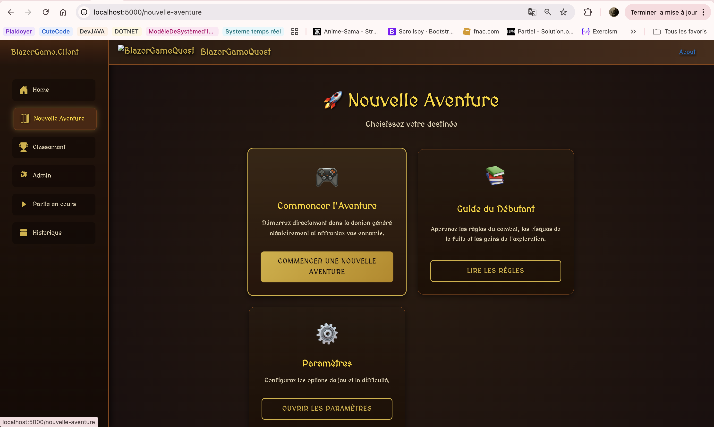
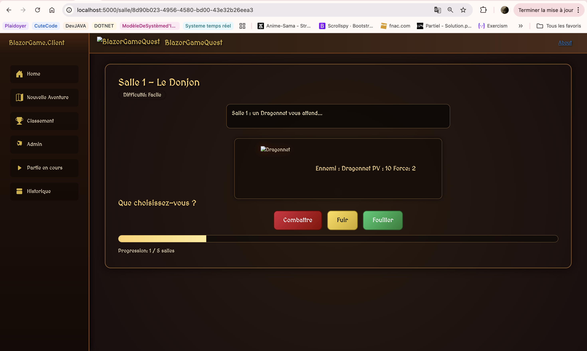
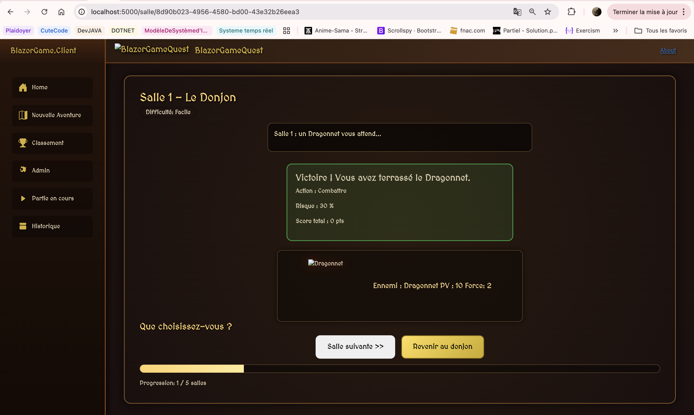
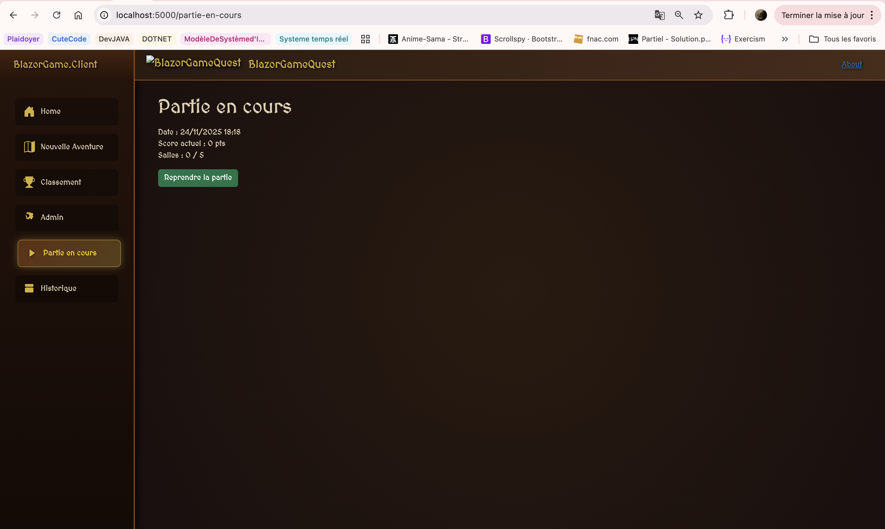
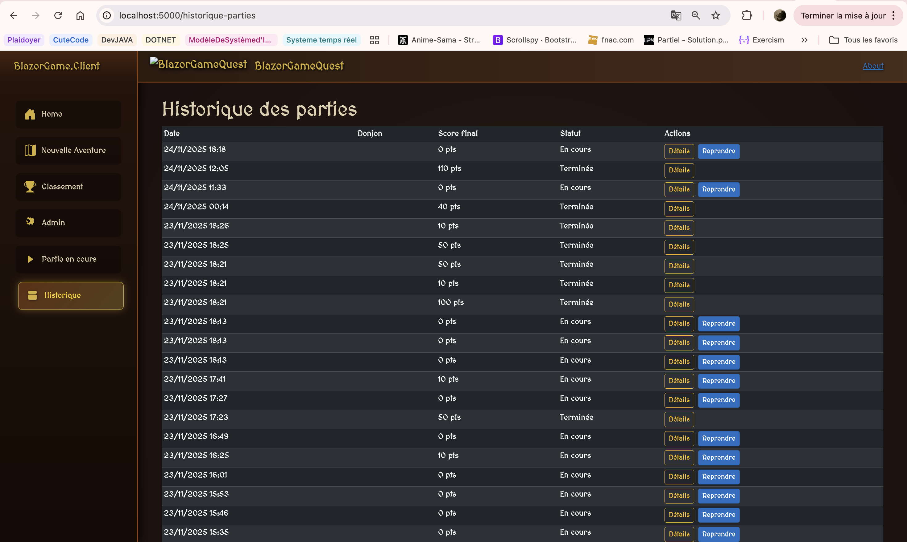

# BlazorGameQuest (Oumou Camara & Lucas Baury)

## Description
BlazorGameQuest est un jeu d’aventure développé avec **.NET 9 / C#** et **Blazor WebAssembly**.  
Le joueur explore des donjons générés aléatoirement, fait des choix (combattre, fuir, fouiller) et marque des points.  
Un administrateur gère les joueurs et les scores via une interface dédiée.

---

## Structure du projet
| Projet | Rôle |
|--------|------|
| **BlazorGame.Client** | Frontend Blazor WebAssembly (pages, navigation, composant Salle). |
| **BlazorGame.Api** | API et gestion de la base de données (PostgreSQL + EF Core). |
| **BlazorGame.Domain** | Classes métiers (Joueur, Partie, Salle). |
| **BlazorGame.Tests** | Tests unitaires (xUnit). |
---
<details>
<summary>Version 1 – Base du projet (Blazor + structure)</summary>

## Fonctionnalités de la Version 1
- Structure complète de la solution .NET.  
- Pages Blazor : Accueil, Nouvelle Aventure, Classement, Admin.  
- Navigation et icônes Bootstrap.  
- Composant **Salle** statique affiché dans “Nouvelle Aventure”.  
- Modèles de base : `Joueur`, `Partie`, `Salle`.  
- Premiers tests unitaires (xUnit). 
- Premiers visuels 

---

## Tests
Les tests se trouvent dans `BlazorGame.Tests/`.  
- SalleTests.cs : création d’une salle, description non vide, difficulté correcte
- PartieTests.cs : identifiant unique, nombre de salles entre 1 et 5, EstTerminee = false
- EnumsAndActionResultatTests.cs : valeurs des enums valides, test du comportement d’ActionResultat
- ControllerTest.cs : test la création de chaque modèle dans la base de donnée avec leurs atributs.

Pour lancer les tests :
```bash
dotnet test
```


## Lancer le projet
```bash
dotnet run --project BlazorGame.Client
```
ou

```bash
cd BlazorGame.Client
dotnet run
```
## Définitions des tests

## Joueur

| **Cas de test** | **Objectif** | **Données / Conditions** | **Résultat attendu** |
|-----------------|---------------|---------------------------|----------------------|
| Création du joueur | Vérifier que le joueur a un identifiant unique | Instancier un nouvel objet `Joueur` | `Id` est unique |
| Score initial | Vérifier la valeur initiale du score | Création d’un joueur sans action | `ScoreTotal = 0` |
| Historique vide | Vérifier l’état de l’historique à la création | Nouveau joueur | `Historique.Count = 0` |
| Dernière connexion | Vérifier la date enregistrée à la création | Nouveau joueur | `DerniereConnexion = Date du jour` |

---

## Partie

| **Cas de test** | **Objectif** | **Données / Conditions** | **Résultat attendu** |
|-----------------|---------------|---------------------------|----------------------|
| Création d’une partie | Vérifier que la partie possède un identifiant et une date | Créer un nouvel objet `Partie` | `Id` ≠ null et `Date = Date actuelle` |
| Nombre de salles | Vérifier que le donjon contient entre 1 et 5 salles | Génération d’une partie | `Salles.Count` entre 1 et 5 |
| Partie non terminée | Vérifier l’état initial | Nouvelle partie | `EstTerminee = false` |
| Score final | Vérifier la valeur initiale du score final | Nouvelle partie | `ScoreFinal = 0` |

---

## Salle

| **Cas de test** | **Objectif** | **Données / Conditions** | **Résultat attendu** |
|-----------------|---------------|---------------------------|----------------------|
| Création d’une salle | Vérifier que la salle a une position, une description et un niveau | Créer une `Salle` | Champs renseignés (`Position`, `Description`, `Niveau`) |
| Choix disponibles | Vérifier que les actions disponibles sont valides | Nouvelle salle | `ChoixPossible` contient Combattre/Fuir ou Fouiller/Fuir selon le type |
| Choix effectué | Vérifier que le joueur peut choisir une action | Affecter une valeur à `ChoixFait` | `ChoixFait` correspond à une des actions possibles |
| Résultat d’action | Vérifier qu’un résultat est associé à l’action | Affecter un `Resultat` à une salle | `Resultat` non nul et cohérent |

---

## Action / Résultat

| **Cas de test** | **Objectif** | **Données / Conditions** | **Résultat attendu** |
|-----------------|---------------|---------------------------|----------------------|
| Création d’un résultat | Vérifier que l’objet `ActionResultat` se crée avec des valeurs valides | Instancier un `ActionResultat` | Champs (`Action`, `Points`, `Message`) non vides |
| Gain de points | Vérifier que l’action attribue correctement les points | Choix "Combattre" | `Points` > 0 |
| Perte de points | Vérifier la pénalité sur une mauvaise action | Choix "Fouiller" → Piège | `Points` < 0 |
| Détection de piège | Vérifier la valeur du booléen `EstPiege` | Action piégée | `EstPiege = true` |
</details>

---

## Gameplay (V3/V4)

- Types de salles : combats et coffres (au moins un coffre par donjon, majorité de combats).
- Actions :
  - Combat : Combattre (30 + 20 × niveau, défaite −15), Fuir (+5), Fouiller (+25 ou −10).
  - Coffre : Fouiller (trésor +40 ou piège −20), Fuir (0).
- Fin de partie : score < 0 ⇒ mort ; dernière salle visitée ⇒ fin d’aventure.
- Admin : export JSON/CSV des joueurs, reset joueur (supprime parties, remet score à 0), classement admin inclut joueurs sans parties.

---
<details>
<summary>Version 2 – Base de données et API</summary>

# Version 2 – BlazorGameQuest

## Objectif de la version 2
L’objectif de cette version est d’ajouter **la persistance des données** grâce à **Entity Framework Core** et **PostgreSQL**,  
et d’exposer les **API REST** permettant d’interagir avec les entités du jeu (`Joueur`, `Partie`, `Salle`) via **Swagger**.

---

## 1. Modélisation et Base de Données

### Modèles déjà présents (version 1)
Les classes principales (`Joueur`, `Partie`, `Salle`) existaient déjà dans la version 1.  
Elles définissaient la structure du jeu : les joueurs, les parties et les salles d’un donjon.

###  Nouveautés version 2
Dans cette version, nous avons ajouté :

- les attributs et relations EF Core pour générer automatiquement les tables et clés étrangères sur les modèles déja présents,

- deux nouveaux modèles : `Administrateur` et `Donjon`.

#### Exemple :
```csharp
// Partie.cs
[ForeignKey(nameof(Joueur))]
public Guid JoueurId { get; set; }

[InverseProperty(nameof(Salle.Partie))]
public List<Salle> Salles { get; set; } = new();

// Salle.cs
[ForeignKey(nameof(Partie))]
public Guid PartieId { get; set; }

[InverseProperty(nameof(Partie.Salles))]
public Partie? Partie { get; set; }
```
### Nouveaux modèles

**Administrateur.cs**  
Permet de gérer les joueurs et les parties.  


**Donjon.cs**  
Représente le lieu principal d’une partie (ensemble de salles générées aléatoirement).  

Ces ajouts permettent à **Entity Framework Core** de reconnaître les relations :
- `Joueur` → plusieurs `Parties`  
- `Partie` → plusieurs `Salles`
- `Administrateur` → plusieurs `Joueurs`
- `Donjon` → plusieurs `Salles`

---

## 2. Configuration EF Core et PostgreSQL

###  Fichiers concernés
- `/BlazorGame.Api/Data/AventureDbContext.cs`  
- `/BlazorGame.Api/Data/AventureDbContextFactory.cs`  
- `/BlazorGame.Api/Program.cs`

### Étapes réalisées

1. **Installation des dépendances**
   ```bash
   dotnet add package Microsoft.EntityFrameworkCore
   dotnet add package Microsoft.EntityFrameworkCore.Design
   dotnet add package Npgsql.EntityFrameworkCore.PostgreSQL
   dotnet add package Swashbuckle.AspNetCore
   ```

2. **Configuration du DbContext**
   ```csharp
   builder.Services.AddDbContext<AventureDbContext>(options =>
       options.UseNpgsql("Host=127.0.0.1;Port=5432;Database=AventureDB;Username=postgres;Password=postgres"));
   ```

3. **Création des migrations**
   ```bash
   dotnet ef migrations add InitialCreate
   dotnet ef database update
   ```

4. **Vérification dans PostgreSQL (Docker)**
   Les tables suivantes ont été créées :
- `Joueurs`
- `Parties`
- `Salles`
- `Administrateurs`
- `Donjons`
- `__EFMigrationsHistory`


---

## 3. Création des Microservices REST

### Fichiers concernés
- `/BlazorGame.Api/Controllers/JoueursController.cs`
- `/BlazorGame.Api/Controllers/AdministrateursController.cs`
- `/BlazorGame.Api/Controllers/DonjonsController.cs`
- `/BlazorGame.Api/Controllers/PartieController.cs`
- `/BlazorGame.Api/Controllers/SalleController.cs`

<details>
<summary> Fonctionnalités CRUD </summary>

###  Fonctionnalités CRUD

#### JoueursController

- `GET /api/Joueurs` → liste tous les joueurs
- `GET /api/Joueurs/{id}` → récupère un joueur précis
- `POST /api/Joueurs` → ajoute un joueur
- `PUT /api/Joueurs/{id}` → met à jour un joueur
- `DELETE /api/Joueurs/{id}` → supprime un joueur
#### AdministrateursController

- `GET /api/Administrateurs` → liste tous les administrateurs
- `GET /api/Administrateurs/{id}` → récupère un administrateur
- `POST /api/Administrateurs` → ajoute un administrateur
- `PUT /api/Administrateurs/{id}` → met à jour un administrateur
- `DELETE /api/Administrateurs/{id}` → supprime un administrateur

#### DonjonsController

- `GET /api/Donjons` → liste tous les donjons
- `GET /api/Donjons/{id}` → récupère un donjon
- `POST /api/Donjons` → ajoute un nouveau donjon
- `PUT /api/Donjons/{id}` → met à jour un donjon
- `DELETE /api/Donjons/{id}` → supprime un donjon

#### PartieController

Ce contrôleur permet de gérer les parties (sessions de jeu).\
Il utilise **Entity Framework Core** et gère les relations entre `Partie`, `Joueur` et `Salle`.

**Fonctionnalités principales :**

- `GET /api/Partie` → récupère toutes les parties
- `GET /api/Partie/{id}` → récupère une partie spécifique
- `GET /api/Partie/joueur/{joueurId}` → récupère les parties d’un joueur donné
- `POST /api/Partie` → crée une nouvelle partie
- `PUT /api/Partie/{id}` → met à jour une partie
- `PATCH /api/Partie/{id}/terminer` → termine une partie et enregistre le score final
- `DELETE /api/Partie/{id}` → supprime une partie

#### SalleController

Ce contrôleur gère les **salles** d’un donjon ou d’une partie, en lien direct avec l’entité `Partie`.

**Fonctionnalités principales :**

- `GET /api/Salle` → récupère toutes les salles
- `GET /api/Salle/{id}` → récupère une salle spécifique
- `GET /api/Salle/partie/{partieId}` → récupère les salles d’une partie
- `POST /api/Salle` → ajoute une salle
- `POST /api/Salle/batch` → ajoute plusieurs salles d’un coup
- `PUT /api/Salle/{id}` → modifie une salle
- `PATCH /api/Salle/{id}/action` → exécute une action du joueur dans la salle (`Combattre`, `Fouiller`, `Fuir`)
- `DELETE /api/Salle/{id}` → supprime une salle
</details>


---

## 4. Ajout et test de Swagger

### Fichier modifié
- `/BlazorGame.Api/Program.cs`

### Code ajouté
```csharp
builder.Services.AddSwaggerGen();
app.UseSwagger();
app.UseSwaggerUI();
```

### Test
Swagger est accessible à :  
`http://localhost:5040/swagger`

Tous les endpoints CRUD ont été testés avec succès.  
Les requêtes POST créent bien des entrées visibles dans PostgreSQL (via Docker).

</details>
---

<details>
<summary>Version 3 – Mise en place de la base de données (PostgreSQL)</summary>

## Structure du projet (Version 3)

| Projet                | Rôle                                                                                                                            |
| --------------------- | ------------------------------------------------------------------------------------------------------------------------------- |
| **BlazorGame.Client** | Frontend Blazor WebAssembly (pages, navigation, composant Salle, interface de jeu du donjon).                                   |
| **BlazorGame.Api**    | API ASP.NET Core + EF Core, logique de jeu (génération des donjons, contrôleurs Joueur / Partie / Salle), connexion PostgreSQL. |
| **BlazorGame.Domain** | Modèles métiers (Joueur, Partie, Salle, Donjon, ActionResultat, enums, etc.).                                                   |
| **BlazorGame.Tests**  | Tests unitaires (xUnit + FluentAssertions, EF Core InMemory).                                                                   |

**Évolutions par rapport aux versions précédentes :**

- `AuthenticationServices` a été renommé et remplacé par `BlazorGame.Api` qui expose l’API REST et la logique de donjon.
- `Models` a été renommé en `BlazorGame.Domain` et centralise les entités métiers.
- `BlazorGame.Tests` a été enrichi avec des tests de contrôleurs (API) et des tests de modèles.

---

## Mise en place de la base de données PostgreSQL

Le projet V3 utilise une base PostgreSQL `AventureDB` initialisée à partir du fichier `database/aventuredb.sql`.

### A. PostgreSQL via Docker (Windows / macOS / Linux)

1. Lancer un conteneur PostgreSQL :

```bash
docker run --name aventure-db \
  -e POSTGRES_PASSWORD=postgres \
  -p 5432:5432 \
  -d postgres
```

Si le conteneur existe déjà :

```bash
docker start aventure-db
```

2. Copier le fichier SQL dans le conteneur :

```bash
docker cp database/aventuredb.sql aventure-db:/aventuredb.sql
```

3. Créer la base `AventureDB` :

```bash
docker exec -it aventure-db \
  psql -U postgres -c "CREATE DATABASE \"AventureDB\";"
```

4. Importer les données :

```bash
docker exec -i aventure-db \
  psql -U postgres -d AventureDB -f /aventuredb.sql
```

---

### B. PostgreSQL installé localement (sans Docker)

1. Créer la base :

```bash
psql -U postgres -c "CREATE DATABASE \"AventureDB\";"
```

2. Importer le dump SQL :

```bash
psql -h 127.0.0.1 -U postgres -d AventureDB -f database/aventuredb.sql
```

---

### C. Configuration de la connexion EF Core

Dans `Program.cs` ou `appsettings.json`, utiliser la chaîne de connexion suivante :

```csharp
builder.Services.AddDbContext<AventureDbContext>(options =>
    options.UseNpgsql("Host=127.0.0.1;Port=5432;Database=AventureDB;Username=postgres;Password=postgres"));
```

> Adapter le mot de passe/port si nécessaire.

---

## Fonctionnalités de la Version 3

### 1. Déroulement d’une partie

- **Génération procédurale de donjons** via `PartieController.DemarrerPartie` :
  - sélection aléatoire d’un `DonjonTemplate` (nom, description, intervalle de nombre de salles),
  - tirage du nombre de salles dans l’intervalle `[MinSalles, MaxSalles]`,
  - création du `Donjon` persistant en base.
- **Création des salles de jeu** dans `PartieController` via `GenererSalleAleatoire` :
  - une suite de salles liée à la partie et au donjon,
  - monstre, PV, force, niveau de difficulté et description par salle,
  - actions possibles standardisées : `Combattre`, `Fouiller`, `Fuir`.
- **Interface de jeu interactive (frontend)** :
  - **Interface de jeu interactive (frontend)
  - Page **Nouvelle aventure** : `/nouvelle-aventure`
  - Page **Salle** (jeu) : `/salle/{partieId}`
  - Page **Classement** : `/classement`
  - Page **Historique joueur** : `/historique`

  **Captures d’écran :**

  - **Page Nouvelle Aventure**  
    

  - **Interface Salle**  
    

  - **Partie en Cours**  
    

  - **Historique**  
     

- **Calcul du score et logique de combat** dans `SalleController.ExecuterAction` :
  - probabilité de victoire / trésor / piège en fonction du choix,
  - points gagnés ou perdus selon l’action (combat, fuite, fouille),
  - mise à jour des PV du monstre, de l’état de la salle et du score global de la partie.
- **Fin de donjon et sauvegarde** :
  - détection de la dernière salle visitée (position maximale de la partie),
  - bascule de `Partie.EstTerminee` à `true` en fin de donjon,
  - persistance du score final et de l’historique des salles en base PostgreSQL.
- **Endpoints de consultation des parties** :
  - `GET /api/Partie` : liste des parties avec joueur, donjon et salles,
  - `GET /api/Partie/joueur/{joueurId}` : historique des parties d’un joueur,
  - `GET /api/Partie/joueur/{joueurId}/encours` : dernière partie non terminée (reprise de partie),
  - `PATCH /api/Partie/{id}/terminer` : clôture explicite d’une partie avec score.

---

## Lancement du projet

Les commandes de lancement restent identiques :

```bash
# API
cd BlazorGame.Api
 dotnet run

# Frontend Blazor WebAssembly
cd ../BlazorGame.Client
 dotnet run
```

Ouvrir ensuite le client sur l’URL indiquée par `dotnet run` (par défaut `https://localhost:5001` ou `https://localhost:7180` selon la configuration).

---
</details>

---
<details open>
<summary>Version 4 – Tableau de bord admin, classement et exports</summary>

## Fonctionnalités principales
- **Classement général** : liste des joueurs actifs avec score cumulé et parties terminées.
- **Tableau de bord admin** :
  - Statistiques synthétiques (actifs/inactifs, parties, score cumulé, top joueur).
  - Gestion des joueurs (activation/désactivation).
  - Liste des parties (score, statut, date) et détail des salles pour la partie sélectionnée.
  - Export JSON des joueurs (nom, mail, score, parties jouées, statut).
- **Filtrage joueurs inactifs** : non visibles dans le classement public, démarrage de partie refusé pour un joueur désactivé.
- **Swagger/Postman** : endpoints Joueurs/Parties/Salles exposés via l’API.

## Endpoints notables (API)
- `GET api/Joueurs/classement` : classement public (actifs uniquement).
- `GET api/Joueurs/classement-admin` : classement complet (actifs/inactifs) pour l’admin.
- `PATCH api/Joueurs/{id}/toggle` : activer/désactiver un joueur.
- `GET api/Joueurs/export` : export JSON des joueurs (nom, mail, score, parties, statut).
- `GET api/Partie` : parties avec Donjon/Joueur/Salles (pour le dashboard).
- `PATCH api/Partie/{id}/terminer` et `PATCH api/Salle/{id}/action` : mettent à jour les scores et recalculent le score total du joueur.

## UI Blazor (Client)
- Page **/classement** : consomme `api/Joueurs/classement`, affiche score/parties/dernière connexion.
- Page **/admin** :
  - Cartes de stats (actifs, parties, score cumulé, top joueur).
  - Tableau des joueurs (score, parties, statut, toggle actif/inactif, export JSON).
  - Tableau des parties + “Voir salles” pour afficher le détail des salles et choix/actions.
  - Styles dédiés pour lisibilité (fonds contrastés, badges statut).

## Modèle de données
- `Joueur.EstActif` (bool) : permet de désactiver un joueur sans le supprimer.
- Recalcul du `ScoreTotal` à la fin d’une partie et sur la dernière salle visitée.

</details>
